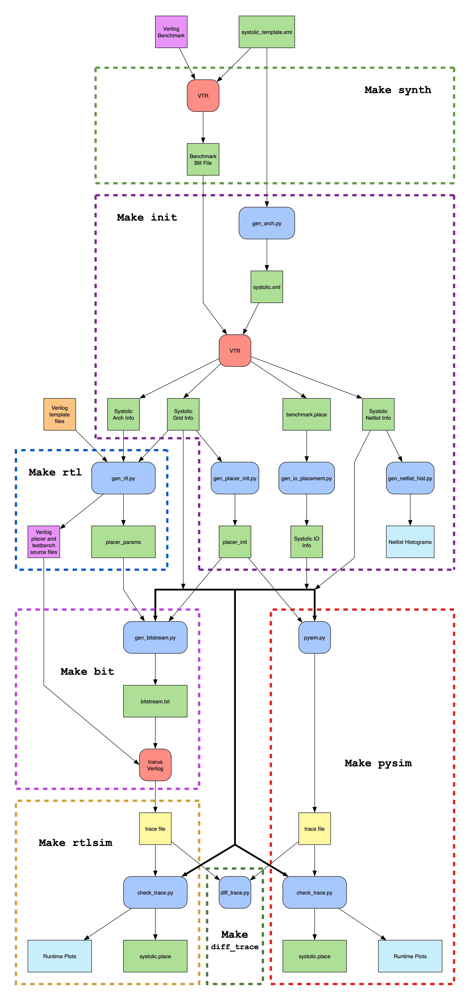

# systolic_page_placer

## Requirements
- [Verilog to Routing](https://github.com/verilog-to-routing/vtr-verilog-to-routing)
- [Icarus Verilog](https://github.com/steveicarus/iverilog)
- Python3
  - matplotlib
  - pyserial
 
## Setup
- Git clone this repository

### VTR
- Git clone Verilog to Routing (VTR), and checkout commit: a632849110cf2dfea3d126993dbf46f010c84072
- Set the environment variable VTR_ROOT to the path of the VTR repository (used by our Makefile)
- Append the code from `systolic_page_placer/vtr_integration/plugin/plugin.cpp` to the end of the `vpr_place()` function in the file `$VTR_ROOT/vpr/src/base/vpr_api.cpp`
- Build VTR

### Icarus Verilog
- Install Icarus Verilog if you want to perform RTL simulations

### Python
- Install `matplotlib`
- Install `pyserial` if you want to interface with a physical implimentation of our systolic placer

## Quickstart
- In our repository, run `make synth` to synthesize a blif file the default Verilog benchmark
- Run `make init` to create metadata about the systolic accelerator, as well as produce benchmark specific files to be processed by the accelerator
- Run `make pysim` to run a Python behavioral simulation of the systolic placer and to validate its trace
- Run `make rtl` to generate the RTL for the systolic placer and the testbench
- Run `make bit` to generate the bitstream of the benchmark to be used by the physical accelerator or the RTL simulation
- Run `make rtlsim` to run the RTL simulation of the systolic placer and to validate its trace
- Run `make diff_trace` to compare the trace files between the behavioral simulation and the RTL simulation
- Run `make route pysim` to route the design placed by the behavioral simulator
- Run `make route rtlsim` to route the design placed by the RTL simulator
- Run `make vtr` to place and route the benchmark blif with VTR

## Scripts
The diagram below indicates which files a script takes in, and which files are produced as outputs.

## License

This project is licensed under the MIT License.

It includes third-party code in `benchmarks/` and `vtr_integration/arch/` released under various licenses by their respective authors. See source files for details.
