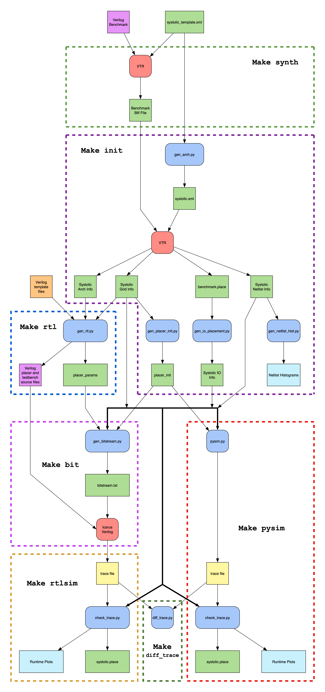

# systolic_page_placer

## Requirements
- [Verilog to Routing](https://github.com/verilog-to-routing/vtr-verilog-to-routing)
- [Icarus Verilog](https://github.com/steveicarus/iverilog)
- Python3
  - matplotlib
  - pyserial (if running the physical Versal accelerator)
- Vivado and Vitis 2021.2 (if running the physical Versal accelerator)
- Versal VCK-190 ES-1 development board (if running the physical accelerator)
 
## Setup
- Git clone this repository

### VTR
- Git clone Verilog to Routing (VTR), and checkout commit: a632849110cf2dfea3d126993dbf46f010c84072
- Set the environment variable VTR_ROOT to the path of the VTR repository (used by our Makefile)
- Append the code from `systolic_page_placer/vtr_integration/plugin/plugin.cpp` to the end of the `vpr_place()` function in the file `$VTR_ROOT/vpr/src/base/vpr_api.cpp`
- Build VTR

### Icarus Verilog
- Install Icarus Verilog if you want to perform RTL simulations

### Python
- Install `matplotlib`
- Install `pyserial` if you want to interface with a physical implimentation of our systolic placer

## Quickstart (Simulation Only)
- In our repository, run `make synth` to synthesize a blif file from the default Verilog benchmark
- Run `make init` to create metadata about the systolic accelerator, as well as produce benchmark specific files to be processed by the accelerator
- Run `make pysim` to run a Python behavioral simulation of the systolic placer and to validate its trace
- Run `make rtl` to generate the RTL for the systolic placer and the testbench
- Run `make bit` to generate the bitstream of the benchmark to be used by the physical accelerator or the RTL simulation
- Run `make rtlsim` to run the RTL simulation of the systolic placer and to validate its trace
- Run `make diff_trace` to compare the trace files between the behavioral simulation and the RTL simulation
- Run `make route pysim` to route the design placed by the behavioral simulator
- Run `make route rtlsim` to route the design placed by the RTL simulator
- Run `make vtr` to place and route the benchmark blif with VTR

## Quickstart (Versal)
- Connect the Versal VCK-190 ES-1 via USB to your machine
- Power on the Versal
- In this repository, run `xsct` in the terminal
- At the xsct prompt, run `source versal_implementation/connect.tcl`. This will configure the Versal
- At the xsct prompt, run `exit`
- In our repository, run `make synth` to synthesize a blif file from the default Verilog benchmark
- Run `make init` to create metadata about the systolic accelerator, as well as produce benchmark specific files to be processed by the accelerator
- Run `make rtl` to generate the RTL for the systolic placer and the testbench
- Run `make bit` to generate the benchmark netlist bitstream for our accelerator
- Run `make fpga` to run the Versal accelerator
- Run `make pysim` to run a Python behavioral simulation of the systolic placer and to validate its trace
- Run `make diff_placement` to diff the placement created by the Versal accelerator with that produced by the Python simulation
- Run `make route_fpga` to route the placement generated by the Versal accelerator

## Scripts
The diagram below indicates which files a script takes in, and which files are produced as outputs.

## Versal Implementation
Impementation is performed with Vivado and Vitis 2021.2 on a Versal VCK-190 ES-1 development board.
- In the makefile, set `WIDTH` and `HIGHT` to 35
- Run `make synth`, `make init`, `make rtl`, and `make firmware`
- Create a new Vivado project in the `versal_implementation/` dir for the Versal VCK-190 board
- Add the directory build/rtl_export to the project's sources
- Remove rtl_export/generated_rtl/tb.sv
- In the TcL Console, run `source ../design_1.tcl`
- Then export the HDL wraper for the the block design, and set it to be the top module.
- Then start to run synthisis. Halt synthisis, and under the `Design Runs` tab, select the `Flow_AreaOptimized_high` synthesis strategy for all of the out of context runs.
- Then restart synthisis.
- Run implementation and finally generate the device image.
- Then export the hardware platform with the device image.
- Create a bare metal Vitis project with the exported hardware platform.
- This this repo's `build/vitis_firmware_export`, copy the source files into the Vitis project.
- Build the Vitis project, and program the Versal.

## License

This project is licensed under the MIT License.

It includes third-party code in `benchmarks/` and `vtr_integration/arch/` released under various licenses by their respective authors. See source files for details.
